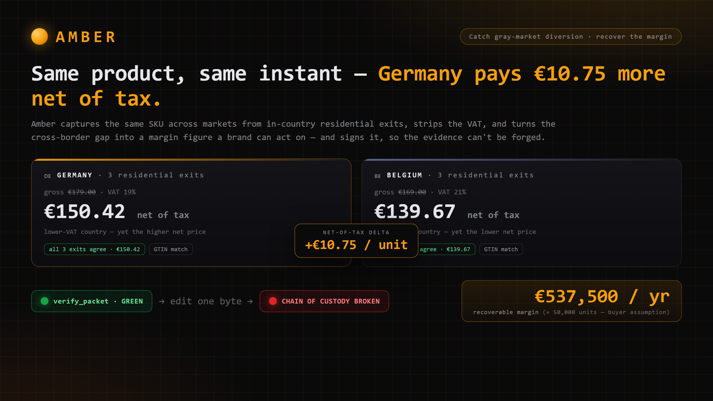
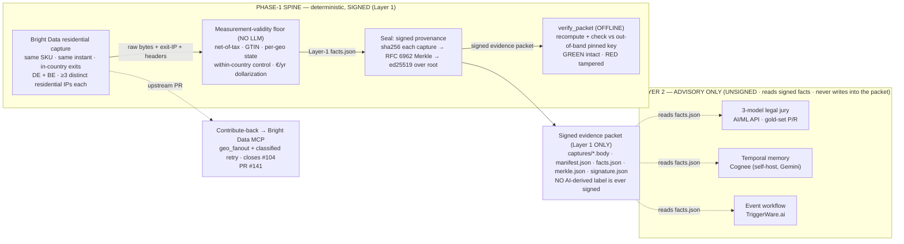

<div align="center">



# Amber — catch gray-market diversion, recover the margin

**Premium brands lose millions a year to gray-market diversion. Amber catches the cross-border price gap across markets and turns it into a margin figure a brand can act on — with signed evidence that can't be forged.**

[](./LICENSE)
[](https://lablab.ai/)
[](#receipts-re-run-every-one-yourself)
[](https://brightdata.com/)
[](#whats-in-the-box)

</div>

A distributor buys cheap in one country and dumps it in another, wrecking the channel and the brand's margin. Today a brand-protection team finds out from a **trust-me dashboard** (Red Points, MarqVision) — a vendor's word that a gap exists, with nothing a brand can independently check and act on. Amber captures the **same SKU across markets from in-country residential exits**, strips the VAT confound, and prints a **margin figure** the brand can act on (terminate the distributor, recover the margin). And because every observation is **cryptographically signed and independently re-verifiable**, it is evidence — not vibes.

> *"Same product page, requests fired the same instant from Germany and Belgium — the store showed different net prices. Amber caught the gap, dollarized it to **€537,500/yr** of recoverable margin, printed a **signed receipt the brand can act on** — you verify it yourself offline — and shipped the geo layer back into Bright Data as an open-source PR."*

The crypto isn't the product. **The recovered margin is the product.** The signing is *why a brand-protection VP can trust the number over a dashboard's word* — of the entire field, Amber is the only one that **signs** its evidence, so editing a byte breaks the signature and a forged re-sign is rejected. That is the difference between *"a vendor told us"* and *"here is proof we can act on."*

---

## Receipts: re-run every one yourself

> Receipts, not vibes. Every number below lives inside the signed packet that ships in this repo. Clone, run, and watch the verifier agree (or break on a tamper). No service, no network, no Amber account.

| What | The receipt | Re-run it yourself |
|---|---|---|
| **The signed catch verifies — offline** | 6 real Bright Data residential captures (3× DE, 3× BE), `verify_packet` prints **GREEN** against the out-of-band pinned signer key | `verify_packet samples/live_packet --pubkey f2de2b5f14785372ced46288f3009448db17495312fe0492377fd14b036a5dc8` |
| **Tamper → it breaks (THE forge-proof)** | Edit one byte of the signed facts → the Merkle root changes → ed25519 fails → **RED, CHAIN OF CUSTODY BROKEN**; revert → GREEN | `cd web && npm run demo` *(drives GREEN → RED → GREEN through the REAL verifier exit code)* |
| **The net-of-tax gap (the channel, not the tax)** | DE net **€150.42** (19% VAT) vs BE net **€139.67** (21% VAT) → **€10.75/unit** net-of-tax delta, DE dearer. Same GTIN `0195949689673`, both `PURCHASABLE` | `python -m amber.capture_cli` facts ship in [`samples/live_packet/facts.json`](./samples/live_packet/facts.json) |
| **Dollarized to a business number** | **€10.75 × 50,000 units/yr = €537,500/yr** recoverable margin (volume is a *labeled buyer assumption*; Amber signs the per-unit delta) | `business_impact` block in [`facts.json`](./samples/live_packet/facts.json); determinism asserted in `tests/test_business_dollarize.py` |
| **The within-country control (it's not exit-IP noise)** | 3 DE exits **all** net €150.42 (spread €0.00); 3 BE exits **all** net €139.67 (spread €0.00) → `all_intra_country_agree=true`. The only thing we changed was the country | `amber-memory persistence samples/live_packet` |
| **The contribute-back PR (the trophy)** | `geo_fanout` tool + classified retry/backoff, table-driven tests, no TODOs — **opened** against the sponsor's repo, closes #104 | [github.com/brightdata/brightdata-mcp/pull/141](https://github.com/brightdata/brightdata-mcp/pull/141) |
| **The 3-model legal jury (gold-set, not consensus theater)** | Google `gemini-2.0-flash` **1.000** · Anthropic `claude-sonnet-4-5` 0.875 · OpenAI `gpt-4o-mini` 0.750 · 3-model **consensus 0.875** (perfect on the decisive labels) | `amber-jury goldset` |

**Why beat-the-twin matters:** a competitor can *hash* a capture (a single SHA-256) — but you can recompute that hash, so anyone who controls the file controls the "proof." Amber **signs** the Merkle root with a private key you don't hold, and `verify_packet` checks it against the signer's **independently-published** public key (`--pubkey`, supplied out-of-band). An attacker who edits a fact *and* re-signs *and* rewrites the repo's allowlist **still can't forge a GREEN**, because you hold the key. Hashing is tamper-*evident*; signing is tamper-*proof*. Of the 46 teams in the field, **0 sign anything.**

### Reproduce it on a clean clone — the 3 commands a judge runs

These are the exact commands and the **real** output. Nothing is mocked; `verify_packet` re-derives every hash, rebuilds the Merkle tree, and checks the ed25519 signature against the key *you* pin.

```console
$ git clone https://github.com/Yashash4/amber && cd amber
$ pip install -e ".[dev]"

# (1) The signed catch verifies GREEN — offline, against the out-of-band pinned key
$ verify_packet samples/live_packet \
    --pubkey f2de2b5f14785372ced46288f3009448db17495312fe0492377fd14b036a5dc8
trusted signer source: --pubkey (CLI) (1 key)
verify_packet: samples/live_packet
  [OK  ] be-01: body sha256 ok (dc804afaae9b6b8f...)
  [OK  ] be-02: body sha256 ok (9b860165ee9a9c81...)
  [OK  ] be-03: body sha256 ok (2bbeb7b0da6bb073...)
  [OK  ] de-01: body sha256 ok (5315f603b653588b...)
  [OK  ] de-02: body sha256 ok (9baa7f16fe3ecaa4...)
  [OK  ] de-03: body sha256 ok (5315f603b653588b...)
  [OK  ] merkle.json: leaf table matches recomputed leaves
  [OK  ] merkle.json/root: root ok (da20841e40815fab...)
  [OK  ] signature.json: algorithm/scheme pinned: ed25519 + sha256 rfc6962
  [OK  ] signature.json: ed25519 signature verified over root under trusted signer f2de2b5f14785372...

  [OK] VERIFIED -- chain of custody intact          # exit code 0
```

```console
# (2) Offline tamper -> RED, then revert -> GREEN. Edit ONE signed fact, no re-sign:
#     facts.json per_capture[0].price_net  150.42 -> 149.42

$ verify_packet samples/live_packet --pubkey f2de2b5f…   # after the edit
  ...
  [X] CHAIN OF CUSTODY BROKEN
  broken at: facts.json
  content of 'facts.json' changed since sealing: recomputed leaf 712d81df8130c29e… !=
    sealed leaf aa3494077f6a107e…                    # exit code 1

$ git checkout samples/live_packet/facts.json         # revert
$ verify_packet samples/live_packet --pubkey f2de2b5f…
  [OK] VERIFIED -- chain of custody intact            # exit code 0
```

Editing a single character of a signed fact changes its Merkle leaf → changes the root → the signature no longer covers it. The verifier names the broken node (`facts.json`) and exits non-zero. Revert the byte and it heals. **That is THE TAMPER PROOF** — the same `verify_packet` exit code drives the `npm run demo` GREEN→RED→GREEN.

### The key-substitution forge — and why it still fails RED

The sharp objection: *"so an attacker edits a fact, recomputes the Merkle root so the packet is internally consistent again, signs the new root with their **own** fresh key, and writes their own public key into `signature.json`. Now everything self-checks — doesn't it pass?"*

No — because `verify_packet` pins the signer to a key supplied **out-of-band** (`--pubkey`), never the key the packet carries. Below is the **real transcript** of that exact attack, run against a throwaway copy of the live packet (the committed packet is never mutated; the attacker's private key is generated in-process and never written to disk):

```console
# --- attacker, working on a stolen copy of the packet ---
[attacker] edited facts.json: business_impact.recoverable_margin_eur_per_year 537500.00 -> 99999999.00
[attacker] recomputed Merkle root -> ed6d42af92936b51... (packet now internally consistent)
[attacker] re-signed with a FRESH ed25519 key, wrote attacker pubkey e6ae7e06306b60a2... into signature.json

# --- the brand verifies it against the signer's INDEPENDENTLY-PUBLISHED key ---
$ verify_packet ./forged_packet \
    --pubkey f2de2b5f14785372ced46288f3009448db17495312fe0492377fd14b036a5dc8
trusted signer source: --pubkey (CLI) (1 key)
  [OK  ] be-01: body sha256 ok (dc804afaae9b6b8f...)        # the attacker's internal
  [OK  ] be-02: body sha256 ok (9b860165ee9a9c81...)        # consistency holds: every
  [OK  ] be-03: body sha256 ok (2bbeb7b0da6bb073...)        # hash recomputes, the new
  [OK  ] de-01: body sha256 ok (5315f603b653588b...)        # root matches, the new
  [OK  ] de-02: body sha256 ok (9baa7f16fe3ecaa4...)        # signature verifies under
  [OK  ] de-03: body sha256 ok (5315f603b653588b...)        # the attacker's OWN key...
  [OK  ] merkle.json: leaf table matches recomputed leaves
  [OK  ] merkle.json/root: root ok (ed6d42af92936b51...)
  [OK  ] signature.json: algorithm/scheme pinned: ed25519 + sha256 rfc6962
  [FAIL] signature.json: signer key not in trusted set: packet is signed by
    e6ae7e06306b60a2c0e1be991e39b9d47a11f4db5d3b394f6dcd4470c5ef9e89 which is not an
    authorized Amber signer (key substitution / forged-key packet).

  [X] CHAIN OF CUSTODY BROKEN
  broken at: signature.json                                  # exit code 1
```

The forged packet is *internally* flawless — and Amber still rejects it, because the brand holds the key and the attacker doesn't. An attacker who additionally rewrites the repo's `trusted_signers.txt` allowlist *still* can't help themselves: the security path is the `--pubkey` you supply out-of-band, not the allowlist in the repo. **This is the line between tamper-evident and tamper-proof.** (Run it yourself: the attack is reproduced exactly by `pytest tests/test_packet_verify.py::test_key_substitution_forge_is_red`.)

---

## Quick links

| | |
|---|---|
| **One-command offline demo** | `cd web && npm run demo` (GREEN → RED → GREEN, the real verifier) · interactive UI: `npm run dev` → http://localhost:3000 |
| **The real signed packet** | [`samples/live_packet/`](./samples/live_packet) — 6 real BD residential captures, ed25519-signed, offline-verifiable |
| **The upstream PR (closes #104)** | https://github.com/brightdata/brightdata-mcp/pull/141 |
| **Architecture diagram** | [`samples/architecture-diagram.png`](./samples/architecture-diagram.png) (+ mermaid below) |
| **Cover image** | [`samples/cover-image.png`](./samples/cover-image.png) |
| **Built on** | [Bright Data](https://brightdata.com/) residential network — the fetcher + geo-witness |

---

## How it works — three lenses on one product

Amber is one capture-and-sign pipeline. Read it as **business value**, then **why the signing makes it actionable**, then **the tech**.

**1. The business lens (the brand-protection VP).** A gray-market distributor arbitrages a price difference between two of the brand's authorized markets. Amber watches the brand's *own* SKUs across markets, surfaces the **net-of-tax** gap (the real arbitrage spread, with the tax confound removed), and dollarizes it: *per-unit delta × the brand's diverted-volume estimate = annual recoverable margin.* That is a number a VP takes to a distributor termination.

**2. The trust lens (why it beats a dashboard).** A dashboard says *"there's a gap"* and you take its word. Amber's gap is a **signed evidence packet**: the raw bytes that were actually fetched, the deterministic facts computed from them, all committed to an RFC 6962 Merkle tree and ed25519-signed. Anyone — the brand, the distributor's counsel, a court — can re-verify it offline. The number is *actionable* because it is *checkable.*

**3. The tech lens (the measurement-validity floor).** A naive cross-border price comparison is junk: different tax, different SKU, exit-IP noise, bot-blocked pages. Amber's deterministic floor (NO LLM) closes each hole: a **sourced VAT table** (net-of-tax), **GS1 GTIN check-digit** identity matching, a **within-country control** (≥3 distinct residential exits per country prove the delta isn't IP noise), a **soft-block gate** (a CAPTCHA/challenge page can never become a finding), and **two-source geo-attribution** (exit-IP RIR + response geo-signals). A `GEO_BLOCKED` verdict requires **≥2 causally-independent signals**; anything short stays `INCONCLUSIVE`.

### Why €10.75 is *not* "just VAT" — the inversion

The naive read is *"Belgium has the higher VAT (21% vs 19%), so of course the prices differ."* Amber strips the tax and the artifact **inverts**: Germany is the **lower-VAT** country (19%) yet charges **more net** (€150.42 vs Belgium's €139.67 at 21%). Stripping the tax doesn't close the gap — **it widens it** (gross delta €10.00 → net delta €10.75). That is the signal a gross comparison hides and a tax-aware one surfaces: **the €10.75/unit gap is the channel, not the tax.**

```
recoverable_margin_eur_per_year = net_of_tax_delta_per_unit × annual_diverted_units
                                = €10.75 × 50,000  =  €537,500 / yr
```

`annual_diverted_units` is a **buyer-supplied volume assumption** (labeled `annual_diverted_units_is_assumption: true` in `facts.json`) — never an Amber measurement. **Amber signs the per-unit delta; the brand supplies the volume.** The figure is a Merkle leaf, so editing it breaks the signature.

---

## Why this matters

Brand protection / anti-counterfeiting is a real, funded category: **Red Points** (~$1.2M/yr enterprise contracts), **MarqVision**, **Corsearch**. Every one of them ships a **dashboard** — a vendor asserting a finding the brand cannot independently verify. That is fine for a takedown queue; it is **not** enough to terminate a distributor or anchor a claim, where the distributor's counsel will ask *"prove this number is real and unaltered."*

Amber occupies the **empty quadrant**: *signed, independently re-verifiable, geo-attributed* web-state evidence. Across the 46 teams in this hackathon's field, **none sign their captures** — the closest (a single SHA-256 hash) is tamper-*evident*, not tamper-*proof*, and ships no verifier. Amber is the only **chain-of-custody attestation for agent-collected web data**, which is also the cleanest unique angle for the Security track.

---

## Quickstart

```bash
# 1. Python core (only `cryptography`, Apache-2.0/BSD, is required at runtime)
python -m venv .venv
. .venv/Scripts/activate          # Windows;  source .venv/bin/activate on POSIX
pip install -e ".[dev]"

# 2. Verify the REAL signed catch — offline, no network, no Amber service
verify_packet samples/live_packet \
  --pubkey f2de2b5f14785372ced46288f3009448db17495312fe0492377fd14b036a5dc8
#   -> GREEN: VERIFIED — chain of custody intact

# 3. THE TAMPER PROOF, one command (GREEN -> RED -> GREEN, the real exit code)
cd web && npm install && npm run demo

# 4. Interactive split-frame + tamper-proof UI
npm run dev          # http://localhost:3000
```

The web demo defaults to the **real** `samples/live_packet` when present (a labeled fixture is the fallback). Point it at any packet dir with `AMBER_PACKET_DIR`.

---

## Architecture


The diagram above is the source of truth. A text equivalent (for screen readers and `grep`):



**The hard line (LOCK 4):** the signed bundle contains **only** Layer-1 deterministic facts + raw captures. Every Layer-2 layer (jury, memory, workflow) *reads* the signed `facts.json` and writes its output as a **physically separate, UNSIGNED** sibling — an LLM never computes a number or asserts a fact into the signed record. (Verified: a packet still `verify_packet`s GREEN after every Layer-2 layer runs over it.)

---

## The signed evidence packet

```
amber_packet/
  captures/<capture_id>.body   raw bytes of each fetched HTTP response
  manifest.json                per-capture metadata + sha256(body)
  facts.json                   Layer-1 deterministic facts (NO LLM)
  merkle.json                  ordered leaf hashes + the Merkle root
  signature.json               ed25519 signature over the root + the signer's public key
```

The Merkle leaves, in fixed order: each capture body, then `manifest.json`, then `facts.json`. Because `facts.json` is itself a leaf, **editing any number in it changes the root and the signature fails** — the verifier flashes RED at `facts.json`, naming the broken node. The same holds for flipping any captured byte or reordering manifest entries. **That is THE TAMPER PROOF.**

For `samples/live_packet`: Merkle root `da20841e40815fab…`, signed by `f2de2b5f14785372…` (ed25519 over the RFC 6962 root).

### The trust pin (out-of-band — the security property)

`verify_packet` checks the signature against a trusted signer key supplied **out-of-band** — never solely the key bundled in the packet (a self-attesting packet proves only "signed by whoever signed it" = nothing). Precedence:

1. `--pubkey <hex>` (repeatable) — **the security path**: pass the signer's independently-published key. An attacker who edits a fact *and* the repo's allowlist still can't forge a GREEN, because *you* hold the key.
2. `AMBER_TRUSTED_PUBKEY` env (comma/space-separated).
3. the committed `amber/keys/trusted_signers.txt` allowlist — a **convenience default** so a fresh clone verifies the golden packet with no flags. It is *not* a security boundary against a repo-modifying attacker; the `--pubkey` pin is.

With **no** trusted key from any source, the verifier **fails closed** (refuses GREEN) rather than trust the bundled key. A downgrade / algorithm-confusion attempt (a packet self-describing a non-ed25519 scheme, or `hash_algorithm: md5`) is rejected RED — the verifier accepts **only** ed25519 over a sha256 RFC 6962 tree (a 4-field pin: `algorithm`, `signed_over`, `hash_algorithm`, `tree`).

---

## The upstream PR — `geo_fanout` + classified retry (closes brightdata-mcp #104)

The contribute-back is the thing the sponsor cares about **most**. Issue #104 on `brightdata-mcp` reports intermittent failures with no retry guidance. Amber's PR ([#141](https://github.com/brightdata/brightdata-mcp/pull/141)) fixes the literal issue **and** ships the geo primitive Amber depends on, upstream.

| Piece | What it does | Shape |
|---|---|---|
| `geo_fanout` tool | A blocked/redirected geo becomes a **first-class signed measurement**, not a discarded error — the brand learns *which* markets refuse access, not just that a fetch failed. | New MCP tool; the geo primitive Amber's capture layer needs. |
| `classifyResponse` | Classifies a response (OK / transient / blocked / geo-refused) so a retry policy can act on the *class*, not a bare status — **the literal #104 fix**, in its own commit. | Pure function, table-driven tests. |
| `computeBackoff` | Deterministic exponential backoff for the transient class. | Pure function, table-driven tests. |

The PR is **mergeable-shaped**: no TODOs, no swallowed errors, table-driven tests, MIT/Apache-compatible. The literal #104 fix (`classifyResponse` / `computeBackoff`) lives in its **own commit** so the "closed your named issue" credit survives a cherry-pick.

---

## Partner integrations — each load-bearing, each mapped

| Partner | How Amber uses it (load-bearing, not bolted-on) | Track / prize |
|---|---|---|
| **Bright Data** (core) | The residential network is the **fetcher + geo-witness**: it captures the raw response, exit-IP, and exit-country headers from real in-country residential IPs — the within-country control needs distinct sticky-session exits, which only a residential net provides. Plus the upstream **#104 PR**. | BD AI Startup Program ($20K) · Web Data overall |
| **AI/ML API** | A **3-model legal jury** (OpenAI + Google + Anthropic, via one OpenAI-compatible gateway) independently classifies the Reg (EU) 2018/302 taxonomy; a split routes to a human. Measured against a hand-labeled **gold set** (P/R), never inter-model agreement. | AI/ML API ($1k) |
| **Cognee** | A self-hosted **temporal knowledge graph** (Gemini backend, one key) answers *"has this SKU shown a net-of-tax gap before — is it persistent?"* — the leap from a one-off gap to a margin-leak signal. **Real captures only**; one capture = a BASELINE, never a faked chart. | Best Use of Agent Memory ($2.4k) |
| **TriggerWare.ai** | A signed delta crossing the brand's threshold **fires a trigger** (SQL-over-everything, confirmed live against `api.triggerware.com`) → a brand-protection **alert stating the signed FACT**, never a verdict. The event-driven close-the-loop. | Best Use of Automated Workflows ($300) |

> **Speechmatics — declined, out loud.** Speech-to-text has no honest home in a price-observation product, so we did **not** bolt it on. Refusing to prize-farm is itself a credibility signal: 4 honestly load-bearing partners beat 5 forced ones.

---

## Sample signed packet — verify it offline

```bash
# GREEN on the real catch (the security path: pin the signer's published key)
verify_packet samples/live_packet \
  --pubkey f2de2b5f14785372ced46288f3009448db17495312fe0492377fd14b036a5dc8

# Or with no flags (uses the committed convenience allowlist)
verify_packet samples/live_packet

# Watch it BREAK on a tamper, then heal on revert (the real exit code drives it)
cd web && npm run demo
```

The packet ships with **no private key** — `signature.json` is the public key + signature only. A fresh `git clone` verifies GREEN with no secret (verifying needs only the public key; sealing needs the secret, which lives outside the repo). Two more reproducible packets ship for methodology: `samples/floor_demo_packet` (a clearly-labeled deterministic-floor **fixture**) and `samples/real_packet` (a minimal real-HTTP golden packet).

---

## What's in the box

| Subsystem | Path | What it is | Tests |
|---|---|---|---|
| **Signed-provenance spine** | [`amber/packet.py`](./amber/packet.py), [`signer.py`](./amber/signer.py), [`merkle.py`](./amber/merkle.py), [`verifier.py`](./amber/verifier.py), [`cli.py`](./amber/cli.py) | `seal_packet` / `verify_packet` + CLI. ed25519 signer/verifier reused from Reef; RFC 6962 Merkle ported Go→Python. | 42 |
| **BD capture + measurement floor** | [`amber/capture/`](./amber/capture) (14 modules) | Residential proxy + Web Unlocker capture · sourced VAT table · GTIN identity · per-geo state + ≥2-signal `GEO_BLOCKED` floor · soft-block gate · two-source geo-attribution (real RIPE-NCC RIR snapshot) · within-country control. NO LLM. | 138 |
| **Dollarization bridge** | [`amber/business/dollarize.py`](./amber/business) | Decimal-exact `net_delta × volume = €/yr`, signed into the bundle; volume labeled an assumption. | 12 |
| **Layer-2 · legal jury** | [`amber/jury/`](./amber/jury) | 3-model jury over the signed facts; UNSIGNED sibling advisory; gold-set P/R. | 36 |
| **Layer-2 · temporal memory** | [`amber/memory/`](./amber/memory) | Cognee self-host (Gemini) + deterministic persistence verdict; real captures only. | 45 |
| **Layer-2 · event workflow** | [`amber/workflow/`](./amber/workflow) | Signed delta → TriggerWare trigger → brand-protection alert (the signed FACT). | 50 |
| **Demo UI** | [`web/`](./web) | Next.js 14 + Tailwind. Split-frame catch · within-country control · THE TAMPER PROOF (RED/GREEN = the real `verify_packet` exit code) · one live cell · one-command offline run. | — |

**Test counts:** **323 passing**, 3 skipped (opt-in live smoke tests for the jury / memory / workflow, run with `AMBER_*_LIVE=1`). `ruff` clean; `tsc --noEmit` + `next build` + `next lint` clean. Zero `TODO`/`FIXME` markers in shipped code.

```bash
pytest          # 323 passing — GREEN on the intact packet; RED on every tamper case
```

---

## Threat model — what the packet proves, and what it does NOT

Security is what you can *defend*, not what you assert. The honest boundary:

- **PROVES:** the request **exited a country-confirmed residential IP** (exit-IP RIR matches the requested country) and the returned bytes are **ed25519-signed + Merkle-committed** — so the capture is **tamper-evident AND tamper-proof**: edit any signed byte and `verify_packet` flashes RED, and a re-signed forgery is rejected because the signer key is pinned out-of-band.
- **Does NOT prove causation.** Geo-attribution here is **`EXIT_ONLY`**, not `CONFIRMED`: the packet shows the request left a DE/BE residential exit and the store served a country page — it does **not** prove the store served that page *because of* the exit IP. The geo variable actually doing the work is the **ccTLD storefront** (`.de` vs `.be`), not the exit IP. We reserve the "served-because-of-country" causal claim for the `GEO_BLOCKED` path, which requires **≥2 causally-independent signals** and is **not** claimed for this price-delta packet.
- **Does NOT defeat server-side cloaking.** A storefront that fingerprints residential proxies and serves a sanitized page can still fool the capture; Amber signs *what was returned*, not *whether the server told the truth*.
- **Trust is out-of-band.** The whole proof rests on verifying against a signer key you obtain **independently** (`--pubkey`, e.g. from the PR description or a published fingerprint), **not** the key inside the packet — a self-attesting packet proves only "signed by whoever signed it." The committed `trusted_signers.txt` allowlist is a fresh-clone *convenience default*, **not** a security boundary against a repo-modifying attacker; the `--pubkey` pin is.
- **The named attack: key substitution.** An attacker who edits a fact, recomputes the root, and re-signs with their own fresh key produces an internally-consistent packet — and the verifier **defeats it by pinning the signer key** (RED: "signer key not in trusted set"; transcript above). With **no** trusted key from any source, the verifier **fails closed** rather than emit GREEN.
- **"Dispatched," not "witnessed."** Captures are *dispatched* the same second (`dispatched_same_second=true`, a signed fact); residential **responses** physically land seconds apart (`same_second_batch=false`, reported honestly) — we never claim a witnessed same-second.

No "court-admissible," no "violation." The packet is integrity-attested evidence a human reads; it does not adjudicate law.

---

## Honest limitations — what we DON'T claim

Restraint is credibility. Amber labels every boundary:

- **"Dispatched the same second," not "witnessed the same second."** All 6 captures are *dispatched* concurrently within one second (`dispatched_same_second=true`, a signed fact); residential **responses** physically span seconds (`same_second_batch=false` for this batch — reported honestly, never hidden). We say "requests fired/dispatched the same instant," never "witnessed."
- **No "court-admissible," no "violation."** The product never adjudicates law on stage. The banner states the signed **FACT** ("PRICE DELTA DETECTED — signed, net-of-tax, chain of custody"); a human draws any legal conclusion. The Layer-2 legal characterization is **UNSIGNED, advisory, and routes splits to a human.**
- **€10.75 is the net-of-tax delta, not "VAT."** Both the gross (€10.00) and net (€10.75) deltas are computed and signed; we show the inversion explicitly rather than implying the tax explains the gap.
- **The volume is the buyer's assumption.** €537,500/yr = the *signed* per-unit delta × a *labeled buyer-supplied* volume (50,000 units). Amber measures the delta; it does not measure diverted volume.
- **Geo-attribution is `EXIT_ONLY` here**, not `CONFIRMED` — the response carried no region subtag and EUR doesn't uniquely pin a country, so we don't over-claim. The exit-IP RIR (RIPE-NCC) agrees with the requested country; that is what we sign.
- **The demo watches a brand's OWN SKUs** — no third-party retailer is named as a "violator" anywhere.

---

## Roadmap (what's next — not built, honestly labeled)

- **Litigation-tier evidence path** — per-matter, private RFC-3161 anchor, counsel-gated; FRE 901/902(13)(14) authentication-ready packaging.
- **The 26-week persistence graph on real data only** — the temporal memory layer compounds from day one; the multi-week chart is built only as real captures accumulate (never faked).
- **Provenance / `session_budget` PRs** (#132) — the second + third upstream contributions, after #141.
- **C2PA / WARC / external-anchor README surfaces** — relegated to documentation, never the core demo.

---

## License

**MIT** — see [LICENSE](./LICENSE). Only `cryptography` (Apache-2.0/BSD) is required at runtime. The `web/` demo is Apache-2.0. GPL/AGPL libraries (`pymerkle`, OpenWPM, browsertrix) are **cited, never imported** — Amber ships clean.

---

## Citations & acknowledgments

- **Bright Data** — the residential network is Amber's fetcher + geo-witness; the contribute-back PR ([#141](https://github.com/brightdata/brightdata-mcp/pull/141)) closes brightdata-mcp #104. Amber claims no Bright Data endorsement.
- **Regulation (EU) 2018/302** (geo-blocking) — the legal taxonomy the **unsigned** Layer-2 jury classifies against. The regulation concerns **access**, not price parity (it permits per-market prices); Amber surfaces the signed fact and leaves the legal conclusion to a human.
- **European Commission, Taxation and Customs Union** — *"VAT rates applied in the Member States of the European Union" (2025 edition)* — the sourced VAT table (DE 19%, BE 21%) every net-of-tax fact carries inline.
- **RIPE NCC** — the real delegated-extended snapshot backing the network-side geo-attribution.
- **AI/ML API · Cognee · TriggerWare.ai · Kiro** — the four honestly load-bearing partners (Speechmatics declined out loud).
- **Reef** (prior project) — the ed25519 signer/verifier and the RFC 6962 Merkle implementation are reused/ported from it.

---

<div align="center">

**lablab.ai · "Web Data UNLOCKED" (sponsor: Bright Data)** · Security · Finance · GTM
Author: **[Yashash Sheshagiri](https://github.com/Yashash4)** · License: MIT

</div>
